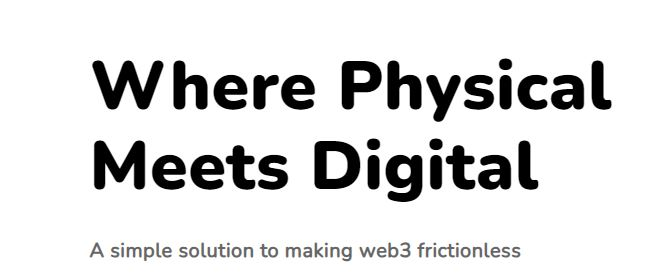
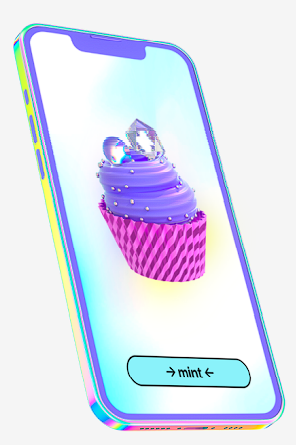

# 🧁 Cupcake Company

**What is Cupcake?**&#x20;

Cupcake represents a web3 enterprise dedicated to bridging the gap between the physical and digital realms using the concept of Phygitals.

By embedding an NFC tag within a physical item, Cupcake has the capability to associate an NFT with that specific physical object, enabling its use for purposes such as authentication, ticketing, exclusive discounts, and loyalty programs.

<figure><figcaption></figcaption></figure>

**Why Choose Cupcake?**&#x20;

Cupcake is a fully web3-oriented company operating on the Solana blockchain, aligning closely with our core values and our commitment to advancing the web3 arena in conjunction with Knittables. Additionally, the NFTs linked to the NFC tags can be effortlessly created via the Cupcake mobile application, eliminating the need for gas fees or prior cryptocurrency knowledge.&#x20;

This approach facilitates the onboarding of new individuals into the web3 community.

<figure><figcaption></figcaption></figure>

Website : [https://cupcake.com/](https://cupcake.com/)

