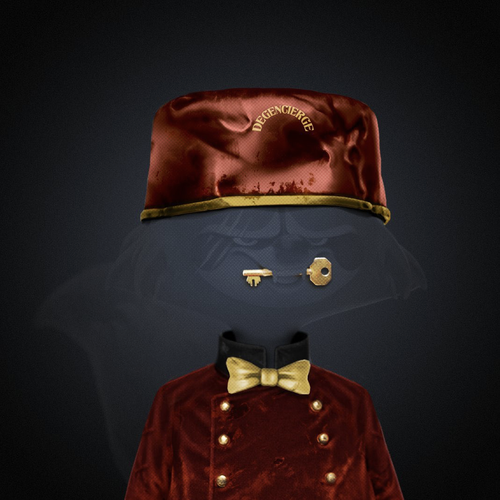

# 🏁 Degencierge

What the fuck is a Degencierge?”&#x20;

This thread will give you a brief understanding of who we are and how we plan to be of service.

<figure><figcaption></figcaption></figure>

We are degens, just like you. Our aim is to provide a point of reference for all things Degeniverse. We provide a personal guide for potential, new, and existing holders. Even if you don’t intend to hold an asset and you’re just curious about what happens in the Dingus Forest…

Welcome! In the last 11 months the Degeniverse has expanded into a number of different components. Degen Apes, Degen Trash Pandas, Eggs, Rugs, Pits trash, Shovels, Dumpsters, Gangbangs..all of this can be quite confusing for the potential Degen. We know because it was for us.

Luckily, a Degen selflessly spent their time answering our questions. They explained Twins, The Gangbang, Exiled Apes and much more. We made the decision to join based on that one Degens kind gesture more so than the NFTs themselves (Which are fucking sick).

We intend on being of service in the most basic way: Degen to Degen. We will field DM’s, provide welcome packets to new users (Don’t get too excited..it’s information. We’re broke bro) medium articles, links to videos etc.

Feel free to say hi. If you have a Degeniverse PFP, we follow. It’s that simple. If you don’t, that’s cool too. Be a lot cooler if you did. Maybe we can talk about that too.

At your service,

Degencierge

<figure><figcaption></figcaption></figure>

**How can i get Degencierge uniform / traits ?**

(only for pandas)

“How tf do I get the Degencierge traits?!” A quick rundown on how you too can look like a degenerate bellhop.&#x20;

<figure><figcaption></figcaption></figure>

6 months ago, this account was created to help new & casual holders of the degeniverse. I went to [@sol\_fiend\_](https://twitter.com/sol\_fiend\_?ref\_src=twsrc%5Etfw%7Ctwcamp%5Etweetembed%7Ctwterm%5E1596330669172740097%7Ctwgr%5E%7Ctwcon%5Es1\_\&ref\_url=notion%3A%2F%2Fwww.notion.so%2Fflawks%2FCupcake-3cb3609f863443859711f83d439a97a9) and pitched him on the idea of doing the art for an initiative that creates 0 revenue. Surprisingly, he agreed and the first Degencierge custom was made.

The only goals we wanted to accomplish were to help a few people find their forever panda/ape/egg, provide a warm welcome and maybe have some fun. Never did we think we’d ever end up with a permanent place in the collections we love.[\
](https://twitter.com/Degencierge/status/1596330677410009089/photo/1?ref\_src=twsrc%5Etfw%7Ctwcamp%5Etweetembed%7Ctwterm%5E1596330683445948416%7Ctwgr%5E%7Ctwcon%5Es2\_\&ref\_url=notion%3A%2F%2Fwww.notion.so%2Fflawks%2FCupcake-3cb3609f863443859711f83d439a97a9)

Luckily, [@pit\_the\_panda](https://twitter.com/pit\_the\_panda?ref\_src=twsrc%5Etfw%7Ctwcamp%5Etweetembed%7Ctwterm%5E1596330683445948416%7Ctwgr%5E%7Ctwcon%5Es1\_\&ref\_url=notion%3A%2F%2Fwww.notion.so%2Fflawks%2FCupcake-3cb3609f863443859711f83d439a97a9) chose violence and created b00ts. If you don’t quite know what b00ts is (or how to use it) not to worry. Keep notis on for tomorrows thread:

We will be looking for those of you that help the new and lost holder.&#x20;

Examples: &#x20;

* Help onboard a new member &#x20;
* Help someone use boots &#x20;
* Help with homework/stars &#x20;
* Help welcome someone new in a meaningful way. &#x20;
* Don’t be a dick.

The people who help the community the most will be selected by the Front Desk DAO members. If your profile has been selected, you will be contacted directly through the official Degencierge twitter account.

<mark style="color:purple;">There are 3 traits that make up the uniform</mark>

<figure><figcaption></figcaption></figure>
