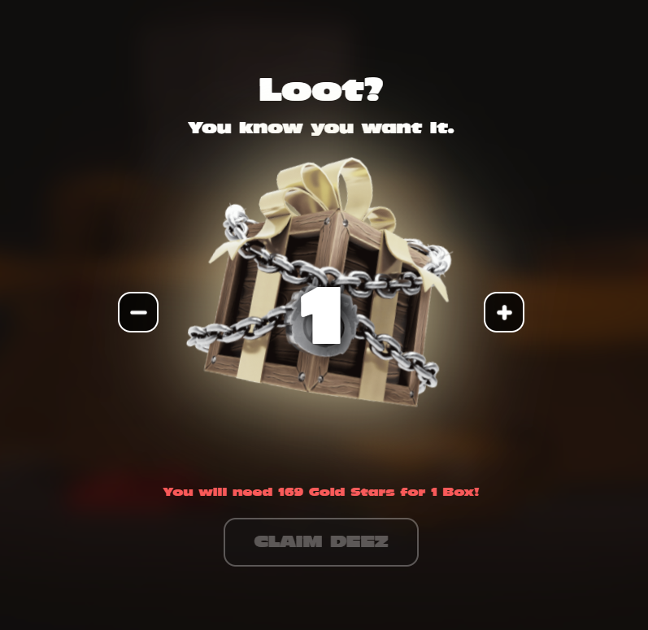

# ⭐ Homeroom / Stars

As you may know, degenerate trash pandas are part of the degeneriverse. Therefore you can participate in some activities organized on the site: [https://www.degenape.academy/](https://www.degenape.academy/).

For example, there is currently an activity that consists in collecting stars to buy a loot box.

<figure><figcaption></figcaption></figure>



There are several ways to get stars :

Holding a DAA (Degen Ape Academy) or a DDB (Degen Drop Bears) → 22 stars for each

Holding a DTP (Degen Trash Pandas) → 4 stars for each

Participate to IRL event like the DAA party in Lisbon for the Solana Breakpoint 2022, it was possible to collect stars with the Cupcake protocol

And others, you can join the DAA & DAOO discord to ask other members and follow some steps to earn stars

DAOO : [https://discord.gg/degendaoo](https://discord.gg/degendaoo) (moved to DAA)

DAA : [https://discord.gg/xbEpAUytJw](https://discord.gg/xbEpAUytJw)

<figure><figcaption></figcaption></figure>

Snapshots are taken periodically to distribute stars. Of course to take advantage of this your panda must not be listed.

In the “Rewards” section, after a snapshot you will be able to claim the stars for each of your NFTs

Important thing to know, the stars you will collect are not transferable from one wallet to another so try to collect all your NFTs in one wallet to claim and get your loot boxes faster.

**What is in the box ?**

Currently there has been no official announcement about the content of the box.

Apparently, it would be a question of having the possibility of obtaining a 1/1 DAA or certain traits for the V2 of apes.


