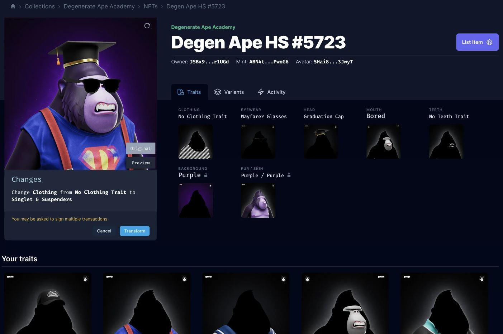
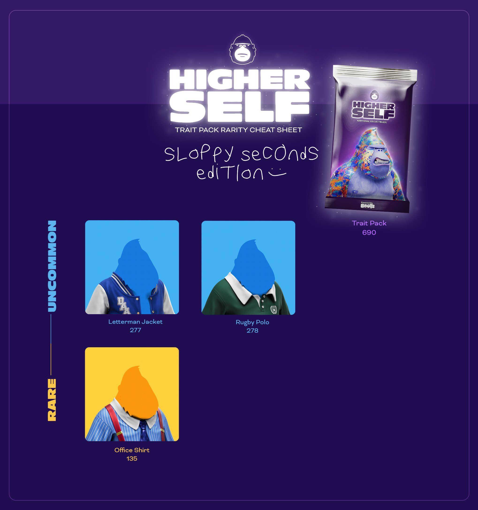

# 🐵 DAA on B00TS

<figure><figcaption>
<a href="https://itsboots.xyz/">https://itsboots.xyz/</a>
</figcaption></figure>



####

<figure><figcaption>
DAA x BOOTS Customizer
</figcaption></figure>

#### DAA was the first project to join and use b00ts v2.

This OG project on Solana has created a second collection called Higher Self, which lets you burn your DAA V1 (main collection which was immutable) and get a DAA V2 (which is mutable with royalty ON) with a touch of glow to recognize a V1 and V2.

<figure><figcaption>
e.g  V1
</figcaption></figure>

 

<figure><figcaption>
e.g V2
</figcaption></figure>

DAA has therefore worked on over a hundred traits so that you can modify your Ape as you wish. 690 trait packs have been distributed to the 600+ V1 burners.

If you want to change a trait, you need to have an other trait of the same type (body, mouth, eyes..)\
When you'll change a trait, the old one will go directly into your wallet as a SFT.

V1 Collection : [https://www.tensor.trade/trade/degenerate\_ape\_academy](https://www.tensor.trade/trade/degenerate\_ape\_academy)

V2 Collection : [https://www.tensor.trade/trade/daahs](https://www.tensor.trade/trade/daahs)

<figure><figcaption></figcaption></figure>

<figure><figcaption></figcaption></figure>

In the end, the traits will come out over the years to create perpetual demand.\
You have a DAA and you want to try boots -> [https://itsboots.xyz/](https://itsboots.xyz/)

<figure><figcaption>
<a href="https://eh5r0tuwzcg.typeform.com/to/C4pU141d">https://eh5r0tuwzcg.typeform.com/to/C4pU141d</a>
</figcaption></figure>
